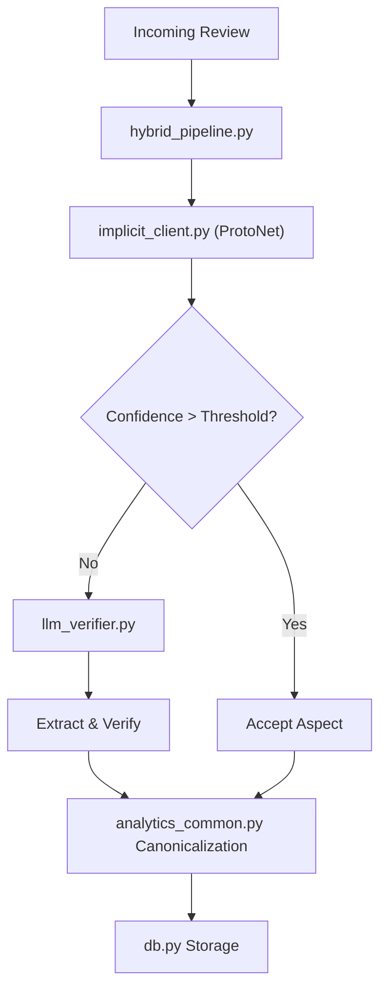

# Backend Architecture

This document explains the parts of the `backend` that matter most for understanding how the runtime inference and data management works.

## How The Backend Works In ReviewOp

The backend serves as the core orchestration layer. When a new review arrives, it must be parsed, its aspects extracted (either implicitly via ProtoNet or explicitly via an LLM), canonicalized, and saved to the database.

## Backend Flow

### What Each Step Does

- `hybrid_pipeline.py`: Main coordinator that routes the review text.
- `implicit_client.py (ProtoNet)`: Fast, local evaluation using the trained ProtoNet bundle.
- `Confidence > Threshold?`: Checks if the implicit model is sure about the aspect.
- `llm_verifier.py`: Fallback to an LLM (like Gemini) for complex or novel aspects.
- `Extract & Verify`: The LLM provides the extraction and confidence score.
- `analytics_common.py Canonicalization`: Normalizes text, reduces plurals, and maps to the canonical aspect key.
- `db.py Storage`: Saves the final prediction to the database.

## The Most Important Files

| Program | Short description |
| --- | --- |
| `backend/core/bootstrap.py` | Initializes the database schema, applies missing columns, and ensures research-grade tables exist to prevent schema drift. |
| `backend/core/db.py` | Manages the SQLAlchemy engine and database sessions. |
| `backend/services/hybrid_pipeline.py` | Orchestrates the extraction workflow between implicit models and LLMs. |
| `backend/services/implicit_client.py` | Wrapper client for interacting with the ProtoNet runtime inference. |
| `backend/services/llm_verifier.py` | Integrates with external LLMs (e.g., Gemini) for high-quality aspect verification. |
| `backend/services/analytics_common.py` | Utility functions for normalizing text, lemmatization, and determining aspect canonicalization. |
| `backend/app.py` | The main FastAPI or Flask application entrypoint exposing the HTTP routes. |
