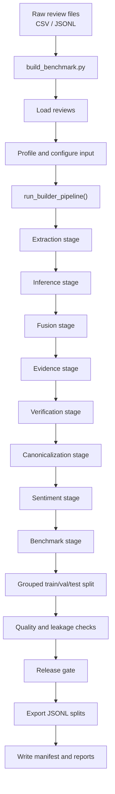

# Dataset Builder

This document explains the parts of `dataset_builder` that matter most for understanding how the model pipeline gets its data.

## dataset_builder Flow

### What Each Stage Does

- `build_benchmark.py`: command-line entry point for the builder.
- `Load reviews`: reads the input files into memory.
- `Profile and configure input`: checks the input shape and builds the run settings.
- `run_builder_pipeline()`: coordinates the full builder run.
- `Extraction stage`: finds explicit aspect phrases in the text.
- `Inference stage`: proposes implicit aspects when the text does not say them directly.
- `Fusion stage`: combines overlapping candidate interpretations.
- `Evidence stage`: attaches text evidence to each interpretation.
- `Verification stage`: checks whether the interpretation is strong enough to keep.
- `Canonicalization stage`: normalizes aspect names into a consistent form.
- `Sentiment stage`: assigns sentiment.
- `Benchmark stage`: packages the final benchmark rows.
- `Grouped train/val/test split`: separates data while reducing leakage risk.
- `Quality and leakage checks`: looks for empty rows, invalid evidence, and split leakage.
- `Release gate`: decides whether the artifact can be exported.
- `Export JSONL splits`: writes the final `train.jsonl`, `val.jsonl`, and `test.jsonl` files.
- `Write manifest and reports`: records the run settings and summary information.

## The Most Important Files

| Program | Short description |
| --- | --- |
| `dataset_builder/scripts/build_benchmark.py` | Command-line entry point that loads reviews, profiles the input, and starts the builder. |
| `dataset_builder/orchestrator/pipeline.py` | Main coordinator that runs the stages, checks quality, applies release gates, and exports artifacts. |
| `dataset_builder/orchestrator/stages.py` | Defines the processing stages used to transform raw reviews into benchmark rows. |
| `dataset_builder/split/grouped_split.py` | Splits data into train, validation, and test sets while reducing leakage risk. |
| `dataset_builder/export/jsonl_export.py` | Writes the final JSONL split files. |
| `dataset_builder/export/manifest.py` | Writes the artifact manifest. |
| `dataset_builder/reports/quality_report.py` | Builds the quality report used for release checks. |
| `dataset_builder/verify/llm_verifier.py` | Runs LLM-based verification when needed. |
| `dataset_builder/ingest/loaders.py` | Reads CSV or JSONL review files. |
| `dataset_builder/ingest/schema_detect.py` | Detects the important structure and text columns in the input. |
