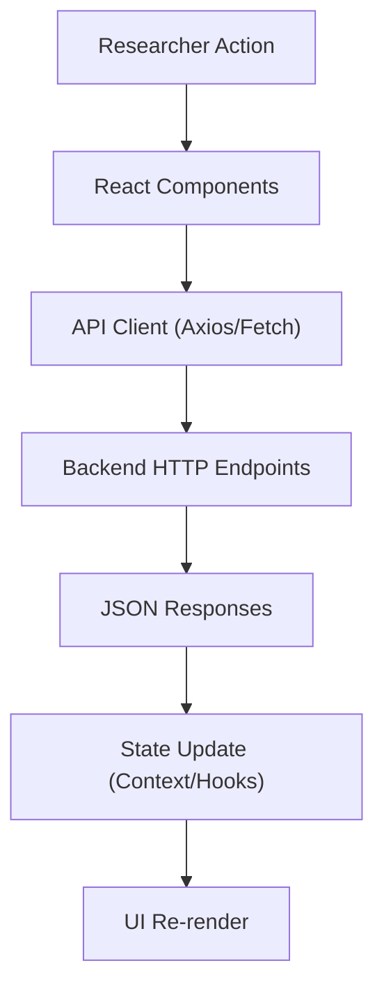

# Frontend Interface

This document explains the parts of the `frontend` that matter most for understanding how researchers interact with the ReviewOp system.

## How The Frontend Works In ReviewOp

The frontend provides a React-based UI. It visualizes the canonicalized aspects, displays graph builders and predictions, and allows researchers to verify the quality of the ProtoNet and LLM pipeline outputs. 

## Frontend Flow

### What Each Step Does

- `Researcher Action`: User interacts with the UI (e.g., viewing a review queue).
- `React Components`: `App.jsx` and pages handle the layout.
- `API Client`: Makes requests to the local backend server.
- `Backend HTTP Endpoints`: Serves data from the `backend` DB.
- `State Update`: The React state is updated with new predictions or metrics.
- `UI Re-render`: The DOM updates to reflect the new state to the user.

## The Most Important Files

| Program | Short description |
| --- | --- |
| `frontend/src/App.jsx` | Main application component that defines routing and layout. |
| `frontend/src/main.jsx` | The React entrypoint that mounts the application to the DOM. |
| `frontend/src/api/` | Directory containing all the network request logic to the backend. |
| `frontend/src/components/` | Reusable React components for the review interface. |
| `frontend/tailwind.config.js` | Styling configuration used across the research dashboard. |
