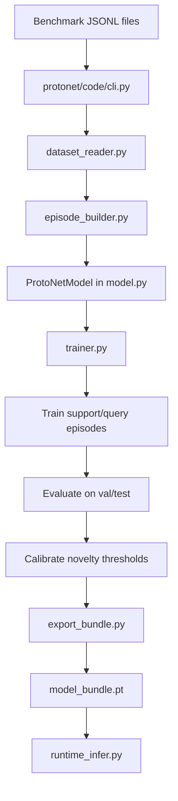

# ProtoNet Pipeline

This document explains the parts of `protonet` that matter most for understanding how the model pipeline works.

## ProtoNet Definition

ProtoNet stands for **Prototypical Network**. It is a few-shot classification method that learns a metric space where each class is represented by a prototype, and new examples are classified by measuring distance to those prototypes.

In simple terms:
- take a few labeled examples,
- turn each example into an embedding,
- average the embeddings for each label,
- and use those averages as prototypes.

## How ProtoNet Works In ReviewOp

ReviewOp uses ProtoNet for implicit aspect prediction. That means it helps when the review does not say the aspect directly.

The model:
1. encodes review text into vectors,
2. builds one prototype per label from the support examples,
3. compares query examples to those prototypes,
4. and uses distance scores to decide the label or routing outcome.

## ProtoNet Flow

### What Each Step Does

- `protonet/code/cli.py`: starts training, evaluation, or export.
- `dataset_reader.py`: validates the benchmark files and loads the rows.
- `episode_builder.py`: creates few-shot episodes from the data.
- `ProtoNetModel in model.py`: encodes text, builds prototypes, and scores examples by distance.
- `trainer.py`: updates model parameters using episodic training.
- `Train support/query episodes`: teaches the model how to classify from small support sets.
- `Evaluate on val/test`: checks performance on held-out data.
- `Calibrate novelty thresholds`: sets the boundaries for known, novel, and abstain behavior.
- `export_bundle.py`: packages the trained model and metadata.
- `model_bundle.pt`: the exported bundle used later at runtime.
- `runtime_infer.py`: loads the bundle and performs inference safely.

## The Most Important Files

| Program | Short description |
| --- | --- |
| `protonet/code/cli.py` | Command-line entry point for training, evaluation, and export. |
| `protonet/code/model.py` | Defines the ProtoNet model that builds prototypes and compares review embeddings to them. |
| `protonet/code/trainer.py` | Contains the training loop, loss functions, checkpoint saving, and prototype bank creation. |
| `protonet/code/runtime_infer.py` | Loads the exported bundle safely and performs runtime inference. |
| `protonet/code/dataset_reader.py` | Validates benchmark files and converts rows into the format ProtoNet expects. |
| `protonet/code/episode_builder.py` | Builds few-shot training and evaluation episodes. |
| `protonet/code/export_bundle.py` | Packages the trained model and metadata into the deployable bundle. |
| `protonet/code/evaluator.py` | Measures model performance on validation and test episodes. |
| `protonet/code/prototype_bank.py` | Builds the prototype representations used for label matching. |
| `protonet/code/selective_decisions.py` | Decides when the model should predict, abstain, or treat a case as novel. |
