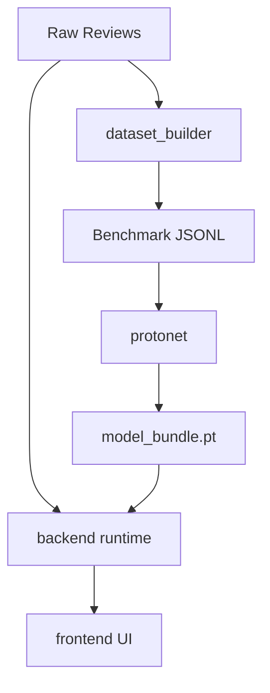

# ReviewOp System Overview

This document explains the high-level architecture of ReviewOp and how its main components interact.

It focuses on the four main modules:
- `dataset_builder`
- `protonet`
- `backend`
- `frontend`

## What ReviewOp Does

ReviewOp turns raw product reviews into structured aspect-and-sentiment data, handling both explicit mentions and implicit meanings.

1. **`dataset_builder`** turns raw reviews into structured benchmark files.
2. **`protonet`** learns label prototypes from those files to infer implicit meaning.
3. **`backend`** acts as the runtime orchestrator, receiving reviews, using ProtoNet or LLMs for extraction, and storing the canonicalized results.
4. **`frontend`** provides a visual interface for researchers to review the pipeline's output and graphs.

## Global Flow

### Component Links
- [[Dataset_Builder]]
- [[ProtoNet_Pipeline]]
- [[Backend_Architecture]]
- [[Frontend_Interface]]

## Simple Summary

If you want the shortest mental model:

1. Build the data with `dataset_builder`.
2. Train the implicit extractor with `protonet`.
3. Run the live extraction pipeline with the `backend`.
4. Visualize and verify the results with the `frontend`.
